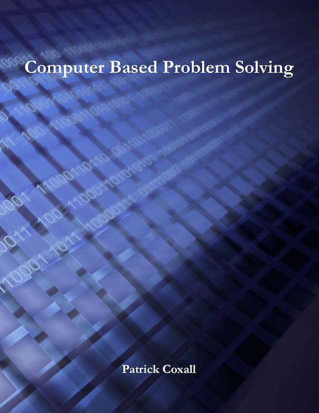

# Forward

The goal of this book is to take students from the point of never having done any formal programming and lead them first through a structured method of problem solving (ex. Input-Process-Output), then into basic Structured Programming and then into the early basics of Object Oriented Programming (or OOP). If this book is used to teach a high school course in computer programming, there are likely many other learning outcomes that students are required to do that are not presented in this book. The focus of this book is strictly on solving problems with computer programming.
