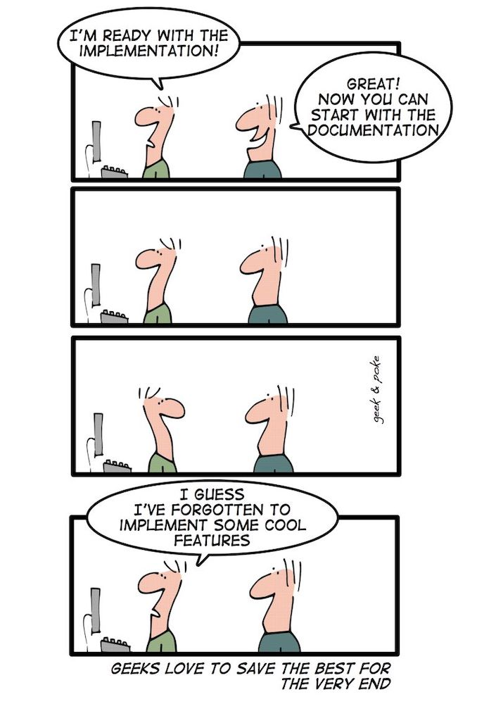

# Preface

It should be remembered that the focus of this book is to teach students how to program, not to just teach them one particular programming language. To do this the focus is on “Problem Solving”, using a computer program as a problem solving aid. Programming languages change over time and come and go but a good foundation of programming concepts and how to solve a problem will allow anyone to get over the syntax of a new programming language.

This book does not include any instructions on how to load, use, create IDEs or any other housekeeping of any particular language. There are many other resources that can aid both students and teachers alike for this. 

Within the textbook you will see words or groups of words that are hyperlinked to <a href='https://en.wikipedia.org/wiki'> Wikipedia</a>. The point of linking to Wikipedia is to give additional information about a topic if the reader is unsure about the concept. Please note that I do not have control over what is placed on Wikipedia and although it seemed useful and correct when I looked at the link, these pages are changing all the time. Despite this, the information is usually correct and can be very helpful.

The cartoons are provided by <a href='http://geek-and-poke.com'>Geek & Poke</a>.